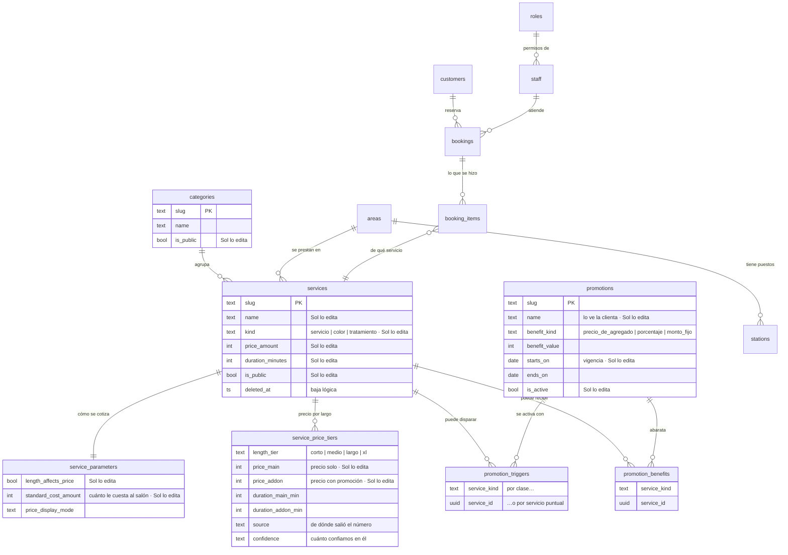

# El modelo de datos parametrizable · qué es un dato y qué es código

> **Qué es esto.** El mapa de las tablas que Sol edita, y de las que no. Es la
> contracara de la auditoría de hardcodeos: aquélla dice qué falta, ésta dice
> cómo queda una vez construido.
>
> **Qué NO es.** No es una lista de deseos. Todo lo que está acá existe en
> `supabase/migrations/`, y las invariantes del clean-room fallan si alguien lo
> rompe. Lo que todavía no existe está marcado como tal.

---

## 1. La idea, en una frase

**Todo lo que puede cambiar por una decisión comercial es una fila.** Todo lo
que cambia por una decisión de arquitectura es código. La frontera está en esa
pregunta y en ninguna otra.

Ejemplo de la diferencia:

| Pregunta | Tipo | Dónde vive |
| --- | --- | --- |
| ¿Cuánto sale una raíz? | Comercial | `service_price_tiers.price_main` |
| ¿Mechas es un color? | Comercial | `services.kind` |
| ¿Los colores abaratan los tratamientos? | Comercial | `promotions` + sus dos lados |
| ¿Cuáles son los estados de una reserva? | Arquitectura | Código y check constraint |
| ¿Qué zona horaria usa el salón? | Geografía | Constante |

---

## 2. Las tres cosas que Sol vende, y por qué comparten tabla

Sol distingue **servicios**, **tratamientos** y **productos**. Los dos primeros
comparten la tabla `services` y se diferencian por una columna, `kind`.

No es una simplificación: es lo que la realidad pide. Un tratamiento **se
reserva, ocupa tiempo y ocupa estación**, igual que un corte. Partirlo en una
tabla `treatments` obligaría a duplicar el motor de disponibilidad —el que
decide si hay lugar— sin ganar nada. Lo que un tratamiento necesita distinto es
**un precio cuando va acompañado**, y eso es una columna.

Los **productos** sí tienen tabla propia (`products`): no se reservan, no ocupan
tiempo, se venden.

```
services.kind
├── 'servicio'     el precio no depende de qué más haya en el turno
├── 'color'        dispara la promoción sobre los tratamientos del mismo turno
└── 'tratamiento'  junto con un color cotiza a price_addon
```

Cambiar `kind` es tildar una opción. Ésa es toda la respuesta a «¿mechas y
balayage reciben la promoción?»: es una casilla, no una consulta.

---

## 3. El diagrama



---

## 4. Por qué la promoción tiene dos lados separados

Una promoción no es un descuento sobre lo mismo que la activa. En el salón, **el
color dispara y el tratamiento se abarata**. Meter las dos cosas en una sola
lista haría imposible decirlo.

```
promotions            «Tratamiento con tu color»
  ├── triggers        kind = 'color'         ← qué tiene que haber en el turno
  └── benefits        kind = 'tratamiento'   ← qué baja de precio
```

Cada lado se puede nombrar de dos maneras, y una sola por fila:

| Forma | Cuándo conviene | Qué pasa cuando Sol agrega un servicio |
| --- | --- | --- |
| Por **clase** (`service_kind`) | La regla general | Se aplica sola |
| Por **servicio** (`service_id`) | La excepción puntual | No se aplica hasta que Sol lo agregue |

La regla que hoy usa el salón son **dos filas**: disparador `color`, beneficio
`tratamiento`. El día que Sol marque balayage como color, la promoción lo cubre
sin que nadie escriba nada.

### Por qué `price_addon` sigue siendo una columna y no un porcentaje

Porque la lista de Sol no es un porcentaje. Karseell baja 65%, Color Shine 52%.
Un único descuento no reproduce su lista, y sus números son los que ella ya
escribió fila por fila.

**La promoción dice cuándo se usa ese precio; la columna dice cuál es.** Los
otros dos tipos de beneficio —`porcentaje` y `monto_fijo`— existen para
promociones que Sol quiera inventar después sin que haga falta una migración.

---

## 5. Cómo se escribe el catálogo

No se abre la tabla a escritura directa. El panel entra por cuatro funciones,
y las cuatro validan y dejan rastro en `audit_log`.

| Función | Qué hace | Qué deja auditado |
| --- | --- | --- |
| `create_service(...)` | Alta: servicio + parámetros + los cuatro largos, **en una sola transacción** | `service.created` |
| `update_service(...)` | Nombre, descripción, categoría, `kind`, público, activo | `service.updated` |
| `delete_service(...)` | Baja **lógica**: `deleted_at` | `service.deleted` |
| `set_service_cost(...)` | Cuánto le cuesta al salón prestarlo | `service.cost_set` |

**Por qué funciones y no `grant insert`.** Un servicio sin fila en
`service_parameters` ni en `service_price_tiers` existe pero no se puede
cotizar, y el motor explota recién cuando una clienta intenta reservarlo. Crear
las tres filas juntas es la única forma de que no exista un servicio a medio
nacer. El clean-room comprueba exactamente eso: si el alta deja dos largos en
vez de cuatro, el workflow falla.

**Por qué la baja es lógica.** Un servicio borrado de verdad se llevaría puestos
los turnos viejos que lo nombran, y el historial de Sol es justamente lo que el
sistema viene a cuidar.

**Quién puede llamarlas.** Sólo `service_role`, que es el backend. `anon` —el
navegador de una clienta— no tiene permiso de ejecución, y hay una invariante
que falla si alguien se lo da.

---

## 6. El costo: por qué NULL y nunca cero

`service_parameters.standard_cost_amount` acepta NULL, y NULL significa **«no
sabemos»**. Sin el dato, el margen del tablero queda en NO DISPONIBLE y no se
estima.

Poner cero diría otra cosa: que el servicio no le cuesta nada al salón. Un
margen calculado sobre un cero inventado es peor que un margen faltante, porque
parece un número.

El primer caso con costo exacto es la **maquilladora tercerizada**: la clienta
le paga al salón y el salón le paga a ella un fijo por maquillaje. Es un dato,
no una estimación, y ahora tiene dónde escribirse.

---

## 7. De dónde salió cada número

Cada precio lleva su procedencia, porque «$28.000» no dice lo mismo si lo dijo
Sol o si lo estimó un desarrollador.

```
industry_baseline   lo puso el sistema para arrancar
      ↓
sol_pricelist       está en la lista de Sol, ella todavía no lo confirmó
      ↓
sol_validated       Sol lo miró y dijo que sí
sol_adjusted        Sol lo cambió
```

`GET /admin/pending-values` lista todo lo que **no** está validado. Es la cola
de trabajo de Sol, y se vacía sola a medida que ella confirma.

Hay una invariante que falla si las 84 filas de su lista entran como
`sol_validated`: son sus precios, pero validarlos por ella sería inventar una
confirmación que nunca dio.

---

## 8. Los tres casos, resueltos como configuración

| Caso | Antes | Ahora |
| --- | --- | --- |
| ¿Mechas y balayage reciben la promoción? | Un `update ... where slug in (...)` en una migración | `update_service(slug, p_kind => 'color')` desde el panel |
| ¿Cuánto se le paga a la maquilladora? | Columna vacía sin forma de escribirla | `set_service_cost('mk-social', 18000)` |
| Las cuatro líneas de coloración | Un `retoque-raiz` genérico | Cuatro altas: `raiz-exiline`, `raiz-itely`, `raiz-sin-tacc`, `raiz-tono-well` |

Los tres están comprobados en el clean-room: el alta, el costo, el cambio de
clase y la baja corren contra una base recién migrada y se revierten.

> **Los valores son de ejemplo.** Qué línea de coloración existe, cuánto sale
> cada una y cuánto se le paga a la maquilladora los pone Sol. El sistema ahora
> tiene dónde guardarlo; no tiene por qué saberlo.

---

## 9. Lo que NO se parametriza, a propósito

| Qué | Por qué |
| --- | --- |
| Los nombres de los módulos del panel y sus permisos | Son el contrato con la matriz de permisos de la base. Un panel cuyas secciones se editan desde el panel es un problema de arranque |
| Los estados de una reserva y la ventana de 10 minutos | Son el modelo, no una preferencia |
| La zona horaria del salón | Constante geográfica |
| Los respaldos de `business_settings` en código | Existen para que el sistema arranque si la base no contesta, no para gobernar |

---

## 10. Dónde lo toca Sol

El panel entra por `/panel/servicios`, que pasó de tres secciones a seis:

| Sección | Qué hace | Endpoints |
| --- | --- | --- |
| **Servicios** | Alta, nombre, categoría, clase, publicación, costo y baja de lo principal del turno | `GET/POST /salon/catalog`, `PATCH`/`DELETE /salon/catalog/:slug`, `POST /salon/catalog/:slug/cost` |
| **Tratamientos** | Lo mismo, filtrado a `kind = 'tratamiento'` | los mismos |
| **Promociones** | Alta, los dos lados de la regla, prender, apagar y borrar | `GET/POST /salon/promotions`, `POST /salon/promotions/:slug/rules`, `.../active`, `DELETE` |
| **Precios y tiempos** | Precio y duración por largo (ya existía) | `POST /salon/services/:slug/price` |
| **Áreas** · **Horarios** | Sin cambios | — |

Las once rutas nuevas exigen permiso de **Servicios**: `view` para leer,
`full` para escribir. Quien atiende el mostrador ve y no toca.

**Servicios y Tratamientos son la misma pantalla con distinto filtro**, y por
eso cambiarle la clase a un servicio lo muda de sección. La fila lo avisa
antes de que pase.

---

## 11. Lo que todavía falta

| # | Qué falta | Por qué importa |
| --- | --- | --- |
| 1 | Que el motor de cotización lea `promotions` en vez de la regla de `promocion.ts` | Hoy la regla vive en dos lugares |
| 2 | Agrupar el catálogo público por dato y no por listas de slugs | `Landing.tsx:413-446` todavía nombra servicios dados de baja |
| 3 | Pantalla para áreas y para los valores de negocio | Tienen endpoint y no tienen UI |
| 4 | ABM de clientas y de categorías | Los de menos urgencia comprobada |

Mientras (1) no esté, la regla vive en dos lugares a la vez: la tabla la tiene
cargada y el código la sigue decidiendo. **Son idénticas hoy**, y ése es el
punto: hace que el reemplazo se pueda verificar comparando las dos, en vez de
ser un salto.

La consecuencia práctica, dicha sin vueltas: **Sol ya puede crear una
promoción desde la pantalla, y el cálculo del precio todavía no la va a
usar.** La que sí funciona es la que está cargada, porque es la misma que
tiene escrita el código.
